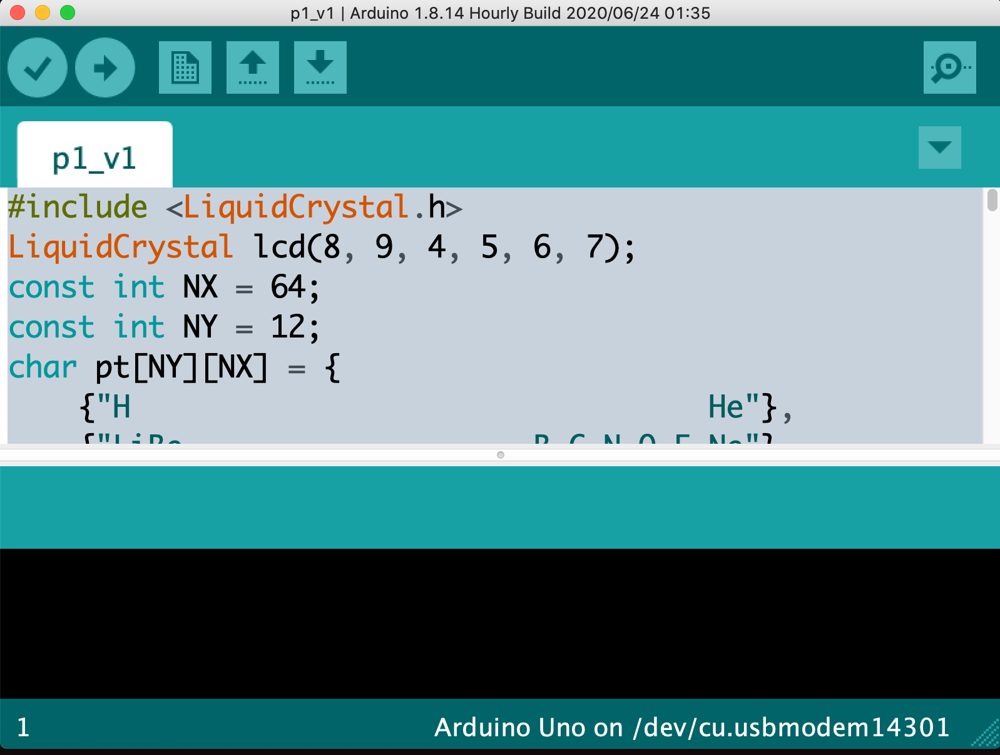

# Schorschis Periodic Table

## Summary

- Use LCD Keypad Shield with 6 buttons.
- Show a part of a period table.
- Move the window with buttons.


No cabling necessary, all connected to the shield. 
The keypad works with voltage splitting. 
To see the log, one has to turn on 'serial output' ('magnifying glass at the 
upper-right corner of the Arduino IDE.)

- Library needed: ```LiquidCrystal.h```
- Need to understand string array




## To do 
- error handling when '-1'st line of the periodic table is called.
- fast feed with left and right most buttons.

## Component

- LCD 1602 Display Keypad Shield HD44780
- Arduino Uno (ATmega328)
- Cable (USB A to USB B)
- micro USB -> TypeC converter cable (for my laptop)
- MacBook Pro
- Power unit (USB Battery)

------------------------------------------
## Trial 1.
### Goal
- Write a code with library.
- Upload the code to Arduino
- Run the code
  + Initialize LCD
  + Show 'Periodic Table' on the LCD

### Import library
Tools -> Manage Library

### Check syntax
1. Use Arduino IDE. 
2. Select tick mark "v".

### Upload program
1. Use Arduino IDE. 
2. Select right arrow "->". 

### Select Device
- Tools -> Ports -> (Select that looks likely)

------------------------------------------
## Trial 2.
### Goal
- Use keypad to move the window
  (=move the text)

------------------------------------------
### Code
```
#include <LiquidCrystal.h>
LiquidCrystal lcd(8, 9, 4, 5, 6, 7);
const int NX = 64;
const int NY = 12;
char pt[NY][NX] = {
    {"H                                 He"},
    {"LiBe                    B C N O F Ne"},
    {"NaMg                    AlSiP S ClAr"},
    {"K CaScTiV CrMnFeCoNiCuZnGaGeAsSeBrKr"},
    {"RbSrY ZrNbMoTcRuRhPdAgCdInSnAbTeI Xe"},
    {"CsBa  HfTaWReOsIrPtAuHgTlPbBiPoAtRn "},
    {"FrRa  RfDbSgBhHsMtDsRgCnNhFlMcLvTsOg"},
    {"                                    "},
    {"    LaCePrNdPmSmEuGdTbDyHoErTmYbLu  "},
    {"    AcThPaU NpPuAmCmBkCfEsFmMdNoLr  "},
};

int x = 0;
int y = 0;

void setup()
{
  Serial.begin(9600);
  lcd.begin(NX, NY);
  renew(x, y);
}
void renew(int x, int y)
{
  int xp = x;
  String p0 = pt[y];
  String p1 = pt[y + 1];

  Serial.println(x);
  Serial.println(xp);

  lcd.clear();

  // right part
  if (x < 0)
  {
    xp = 0;
    Serial.println("substring: ");
    p0 = p0.substring(-x, NX);
    p1 = p1.substring(-x, NX);
  };

  //    Serial.println("\n");
  Serial.println(p0);
  Serial.println(p1);

  lcd.setCursor(xp, 0);
  lcd.print(p0);

  lcd.setCursor(xp, 1);
  lcd.print(p1);

  // Serial output for debugging
  /*  Serial.print(x);
    Serial.print("\t");
    Serial.print(y);
    Serial.print("\n"); */
  /*  for (int i = 0; i < NY; i++)
    {
      Serial.println(pt[i]);
    }; */
}

void loop()
{
  //  int x, y;
  int ADCdata = analogRead(A0);

  if (x < -NX)
  {
    x = -NX;
  };
  if (x >= NX)
  {
    x = (NX - 1);
  };
  if (y < 1)
  {
    y = 0;
  };
  if (y > NY)
  {
    y = (NY - 1);
  };

  lcd.setCursor(x, y);

  if (ADCdata < 50)
  { // right
    x = x + 1;
    renew(x, y);
  }
  else if (ADCdata < 150)
  { // up
    y = y - 1;
    renew(x, y);
  }
  else if (ADCdata < 350)
  { // down
    y = y + 1;
    renew(x, y);
  }
  else if (ADCdata < 500)
  { // left
    x = x - 1;
    renew(x, y);
  }
  else
  {
  }
  delay(200);
}

```

------------------------------------------


## Reference
1. http://physics.cocolog-nifty.com/weblog/2018/07/arduino18lcd-8c.html
2. https://picavr.uunyan.com/avr_m2_dds_fg_ctrl.html
3. https://forum.arduino.cc/t/a-true-array-of-strings-heres-how-i-did-it-using-pointers/319474/2
4. https://www.arduino.cc/en/Reference/LiquidCrystal